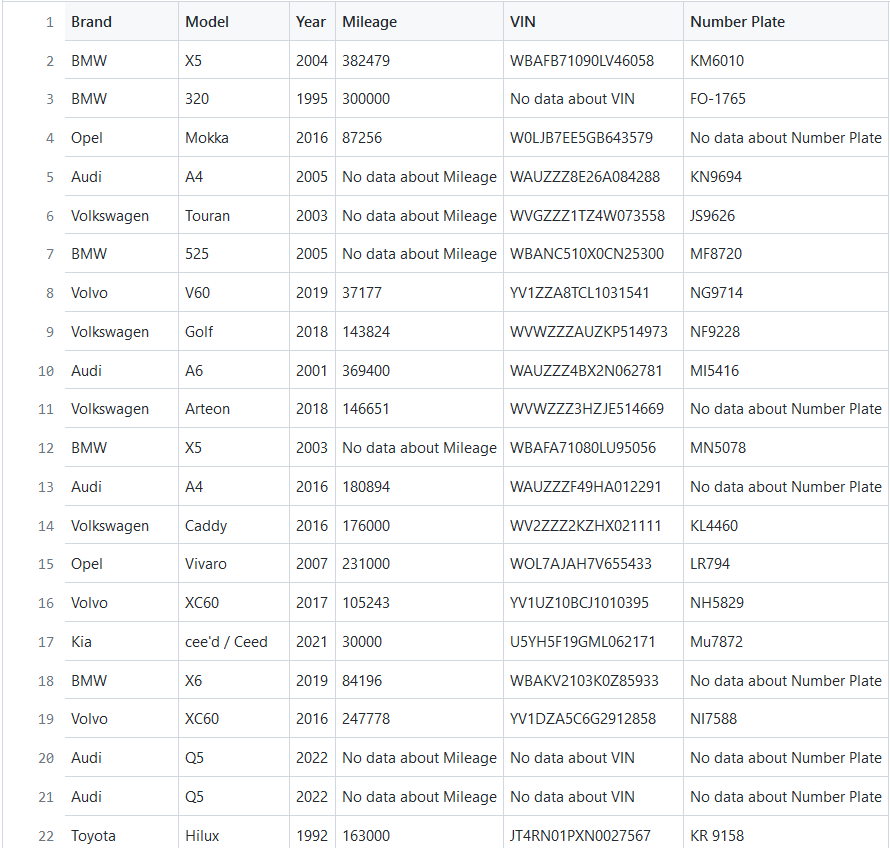

# pp.lv WEB Scraper


## Task:

By using Scrapy framework, obtain information about cars from pp.lv website. There suppose to be information about:

- Brand
- Model
- Year (if exist)
- Mileage
- VIN (if exist)
- Plate number (if exist)

## About project

To fulfill task, I obtained API endpoints from website and create Web Spider which is scraping through API endpoints.

## Install

In order to install spider type in to your terminal:

```
git clone git@github.com:Alg1mantas/Scraping.git
```

and also don't forget to install libraries:

```
pip install -r requirements.txt
```

## How to use it?

At first, navigate your terminal to pp_lv directory and type:

```
scrapy crawl cars
```

After about five minutes ( depends on how much of pages of data exist) you will get a file named: pp_lv.csv as an output. In file you will find all nessesary data about cars on website.



## Happy scraping!
